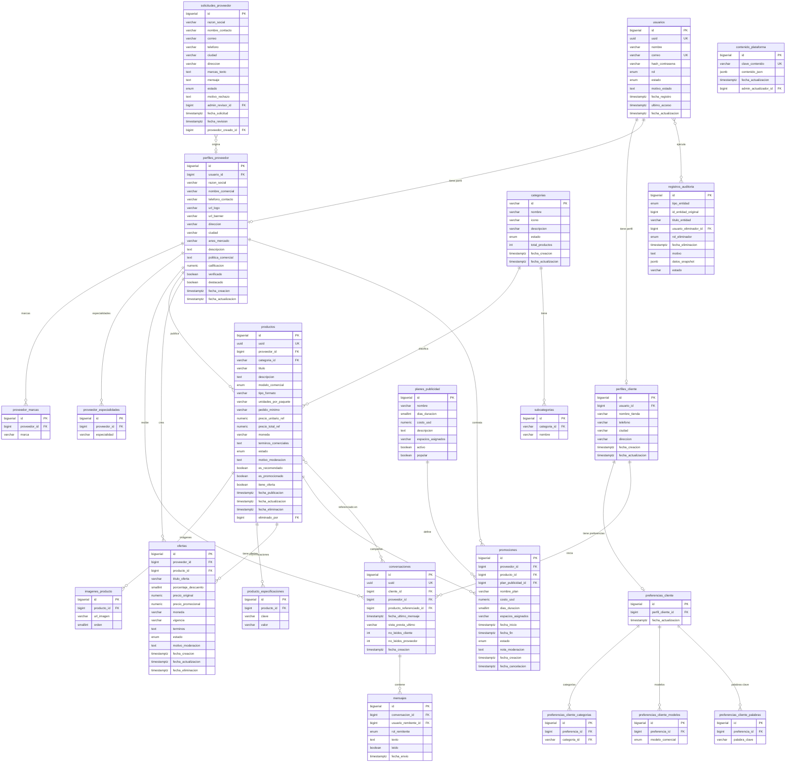

# 03. Modelo Relacional — Diagrama de Entidades y Relaciones

> Plataforma COMPUNEX B2B — PostgreSQL 15+ Normalizado Español

---

## Diagrama Entidad-Relación (Mermaid) — Español Normalizado



---

## Cardinalidades Clave (PostgreSQL Español)

| Relación | Cardinalidad | Descripción |
|---|---|---|
| usuarios → perfiles_cliente | 1:1 | Un usuario CLIENTE tiene exactamente un perfil |
| usuarios → perfiles_proveedor | 1:1 | Un usuario PROVEEDOR tiene exactamente un perfil |
| perfiles_cliente → preferencias_cliente | 1:1 | Un cliente tiene exactamente un set de preferencias |
| preferencias_cliente → preferencias_cliente_categorias/modelos/palabras | 1:N | Normalización de arreglos |
| perfiles_proveedor → proveedor_marcas/especialidades | 1:N | Normalización de JSON |
| perfiles_proveedor → productos | 1:N | Un proveedor tiene muchos productos |
| perfiles_proveedor → ofertas | 1:N | Un proveedor tiene muchas ofertas |
| perfiles_proveedor → promociones | 1:N | Un proveedor tiene muchas campañas |
| categorias → productos | 1:N | Una categoría agrupa muchos productos |
| categorias → subcategorias | 1:N | Una categoría tiene varias subcategorías |
| productos → imagenes_producto | 1:N | Un producto tiene múltiples imágenes |
| productos → producto_especificaciones | 1:N | Un producto tiene múltiples specs clave-valor |
| productos → ofertas | 1:N | Un producto puede tener varias ofertas históricas |
| productos → promociones | 1:N | Un producto puede ser promocionado en diferentes períodos |
| planes_publicidad → promociones | 1:N | Un plan sirve de base para múltiples campañas |
| perfiles_cliente + perfiles_proveedor → conversaciones | N:M a través de conversaciones | Par único por UNIQUE (cliente_id, proveedor_id) |
| conversaciones → mensajes | 1:N | Una conversación tiene muchos mensajes |

---

## Flujos de Relación Principales (PostgreSQL)

### Flujo: Registro de Cliente
```
POST /register
→ Inserta: usuarios (rol=CLIENTE)
→ Inserta: perfiles_cliente (usuario_id)
→ Inserta: preferencias_cliente (perfil_cliente_id) — vacías
```

### Flujo: Aprobación de Proveedor
```
POST /contact → Inserta: solicitudes_proveedor (estado=PENDIENTE)
ADMIN → PATCH /admin/applications/{id}/approve
→ Actualiza: solicitudes_proveedor (estado=APROBADA)
→ Inserta: usuarios (rol=PROVEEDOR)
→ Inserta: perfiles_proveedor (usuario_id) + proveedor_marcas / especialidades
→ Actualiza: solicitudes_proveedor.proveedor_creado_id
```

### Flujo: Creación de Producto
```
PROVEEDOR → POST /providers/me/products
→ Inserta: productos (proveedor_id, estado=ACTIVO, es_recomendado=false)
→ Inserta: imagenes_producto (producto_id, url_imagen)
→ Inserta: producto_especificaciones (producto_id, clave, valor)
→ Actualiza: categorias.total_productos + 1
```

### Flujo: Oferta sobre Producto
```
PROVEEDOR → POST /providers/me/offers
→ Inserta: ofertas (producto_id, estado=ACTIVA)
→ Actualiza: productos.tiene_oferta = true
```

### Flujo: Campaña Publicitaria
```
PROVEEDOR → POST /providers/me/promotions
→ Inserta: promociones (fecha_inicio=NOW(), fecha_fin=NOW()+dias_duracion, estado=ACTIVA)
→ Actualiza: productos.es_promocionado = true
```

### Flujo: Eliminación Lógica de Producto (Proveedor)
```
PROVEEDOR → DELETE /providers/me/products/{id}
→ Actualiza: productos.estado = ELIMINADO_LOGICO, fecha_eliminacion = NOW()
→ Inserta: registros_auditoria (datos_snapshot = JSONB del producto)
→ Actualiza: categorias.total_productos - 1
```

### Flujo: Inicio de Chat
```
CLIENTE → POST /chat/conversations
→ Si existe conversación con ese proveedor: retorna existente (UNIQUE cliente_id, proveedor_id)
→ Si no: Inserta conversaciones (cliente_id, proveedor_id, producto_referenciado_id?)
CLIENTE → POST /chat/conversations/{id}/messages
→ Inserta: mensajes (conversacion_id, usuario_remitente_id, texto)
→ Actualiza: conversaciones.fecha_ultimo_mensaje, vista_previa_ultimo, no_leidos_proveedor + 1
```

---

## Diagrama Simplificado de Flujo de Estados (PostgreSQL)

### Estados de `productos.estado`
```
ACTIVO ──[proveedor deshabilita]──→ DESHABILITADO_POR_PROVEEDOR
DESHABILITADO_POR_PROVEEDOR ──[proveedor reactiva]──→ ACTIVO

ACTIVO ──[admin oculta]──→ OCULTO_POR_ADMIN
OCULTO_POR_ADMIN ──[admin restaura]──→ ACTIVO

ACTIVO ──[proveedor/admin elimina]──→ ELIMINADO_LOGICO (terminal)
DESHABILITADO_POR_PROVEEDOR ──[admin elimina]──→ ELIMINADO_LOGICO (terminal)
OCULTO_POR_ADMIN ──[admin elimina]──→ ELIMINADO_LOGICO (terminal)
```

### Estados de `ofertas.estado`
```
ACTIVA ──[proveedor deshabilita]──→ DESHABILITADA
DESHABILITADA ──[proveedor activa]──→ ACTIVA

ACTIVA ──[admin oculta]──→ OCULTA_POR_ADMIN
OCULTA_POR_ADMIN ──[admin restaura]──→ ACTIVA

ACTIVA | DESHABILITADA ──[proveedor/admin elimina]──→ ELIMINADA_LOGICA (terminal)
```

### Estados de `solicitudes_proveedor.estado`
```
PENDIENTE ──[admin aprueba]──→ APROBADA (terminal)
PENDIENTE ──[admin rechaza]──→ RECHAZADA (terminal)
```

### Estados de `promociones.estado`
```
ACTIVA ──[tiempo expirado]──→ EXPIRADA (automático por fecha_fin)
ACTIVA ──[admin cancela]──→ CANCELADA (terminal)
```

### Estados de `usuarios.estado`
```
ACTIVO ──[admin desactiva]──→ INACTIVO
INACTIVO ──[admin activa]──→ ACTIVO
ACTIVO | INACTIVO ──[admin bloquea]──→ BLOQUEADO
BLOQUEADO ──[admin desbloquea]──→ ACTIVO
```
